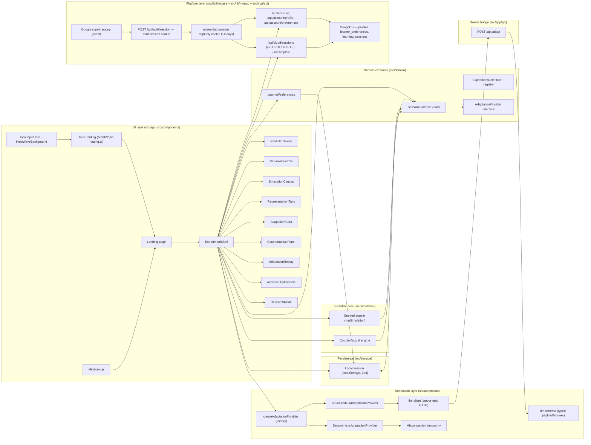

# UnseenLab — Architecture

## High-level diagram

## Components

### Simulation engine (`src/simulation/nuclear-chain-reaction.ts`)

Deterministic, seeded (mulberry32) conceptual model. One step = one generation: each neutron rolls escape (0.12), then absorption (absorptionProbability × absorberPosition), then fission (materialDensity × 0.5), releasing one extra net neutron. Safety caps: population ceiling 500 (stop), step limit (stop), parameter clamping, nonnegativity. Same seed + same parameters ⇒ identical result. Exposes `runSimulation(params): SimulationRunResult`.

### Experiment registry (`src/domain/experiments.ts`)

Typed `ExperimentDefinition` per lab: id, title, pitch, goal, parameter specs (min/max/step/label/plain explanation), defaults, status (`ready` | `planned`). Registry maps lab id → definition. Future labs register here without touching the shell.

### Homepage (`src/components/ui/`, `src/lib/topic-routing.ts`)

`TopicInputHero` ("What topic do you need help with?") sits on a `HeroWaveBackground` and routes typed topics through `topic-routing.ts` (`normalizeTopic` + supported-phrase matching, capped at 1000 chars): a supported topic links into the matching lab, an unsupported topic shows a friendly explanation, empty input is inert. `MiniNavbar` provides stable in-page navigation. The landing page (`src/app/page.tsx`) composes these with "How it works", the "Available lab" card ("Start this lab"), "Future labs", and the footer disclaimer.

### Learner preferences (`src/domain/learner.ts`)

Explicit, learner-controlled settings: animation speed, reduced motion, information density, preferred representations, one-variable mode, high contrast, text scale. Zod-validated; persisted locally. (The former `feedbackTiming` field remains in the schema for compatibility but its UI control was removed — nothing consumes it.)

### Session evidence (`src/domain/evidence.ts`)

Typed, Zod-validated records: predictions (answer, structured key, confidence, timestamps), trials (parameters, snapshots, changed variables), representation events, adaptation proposals (type, reason, evidence IDs, proposed changes, decision), concept evidence. This is the data the adaptation layer reads and the replay renders. Trials are appended, never overwritten, so one session holds the full multi-trial journey.

### Adaptation provider (`src/adaptation/`)

`AdaptationProvider.propose(input): Promise<AdaptationProposal[]>` — typed input/output, replaceable. A factory (`createAdaptationProvider()` in `llm-provider.ts`) selects the provider at build time: `StructuredLLMAdaptationProvider` when `NEXT_PUBLIC_LLM_ENABLED=1`, otherwise `DeterministicAdaptationProvider`. The deterministic provider applies bounded rules in a fixed order (ask prediction again, freeze variables, show graph, compare trials, slow animation, causal view, reduce density), capped at 3 proposals, never re-offering rejected types, never increasing motion intensity under reduced motion, and attaching evidence IDs to every proposal. `misconception-taxonomy.ts` classifies evidence into five concepts with conservative structured/keyword matching (documented offline fallback).

### Structured LLM provider + server bridge (`src/adaptation/llm-provider.ts`, `llm-client.ts`, `llm-schema.ts`, `src/app/api/adapt/route.ts`)

The optional hosted path: `llm-schema.ts` defines the bounded typed payload (prediction, structured answer, confidence, trial summary, behavior counts) and the Zod-validated answer schema (enum-only misconception and intervention, confidence 0..1, 1–3 evidence strings, nullable follow-up question). `llm-provider.ts` wraps the LLM call inside the `AdaptationProvider` contract. The server bridge `POST /api/adapt` reads `LLM_API_KEY` server-side only, calls the OpenAI-compatible chat completions API through `llm-client.ts` (12s client / 15s server timeout, optional `LLM_DISABLE_THINKING`), validates the typed answer, and returns either `{ data }` or `{ fallback: true, reason }`. ANY failure — no key, timeout, invalid JSON, schema violation — falls back to the deterministic rules. Telemetry logs only model, reason, and elapsed milliseconds. Proposals are tagged `source: "llm" | "rules"` and shown as "AI interpretation" vs "Offline rules".

### Representation layer (`src/components/lab/representation-tabs.tsx`)

Five learner-switchable views of the same trial: animation (canvas), graph (custom SVG chart — no chart library), equation (abstract balance with the trial's numbers), causal (SVG flow diagram), plain language (generated summary). All reads only.

### Counterfactual engine (`src/simulation/counterfactual.ts`)

Deep-clones the original trial's parameters, changes exactly one of four allowed variables, keeps the same seed and duration, runs the engine, returns `{ original, counterfactual, changedVariable }` with the original untouched (reference identity preserved). Same seed ⇒ identical randomness ⇒ difference is attributable to the single variable.

### Replay timeline (`src/components/lab/adaptation-replay.tsx`)

Renders the recorded journey: initial prediction → variables changed → outcome → interaction pattern → possible conceptual friction → adaptation offer + decision → updated prediction → counterfactual → evidence of changed understanding. Pure rendering of session evidence. With multiple trials in a session, the replay lists every trial in order — so the learner can watch their reasoning change across the loop.

### Persistence (`src/storage/session-storage.ts`)

Anonymous localStorage persistence with Zod validation on read; corrupt data fails safe to defaults; no telemetry. `exportSessionJson` / `clearLocalSession` back the research mode.

### Platform layer (`src/lib/firebase/`, `src/lib/mongo/`, `src/app/api/{auth,account,cloud}`)

The optional signed-in layer, replacing the Supabase (Google OAuth + Postgres RLS) stack.

**Auth (Firebase Auth, session cookie).** Sign-in is a Google popup (`signInWithPopup`); on success the client exchanges the fresh ID token for an httpOnly session cookie named `unseenlab.session` via `POST /api/auth/session`. `src/lib/firebase/server.ts` mints it with firebase-admin `createSessionCookie` (14-day expiry, `SESSION_COOKIE_MAX_AGE_MS`) and verifies it on every protected render/route with `verifySessionCookie(cookie, true)`. Each signed-in page mount re-mints the cookie from the in-memory ID token (keepalive) so the server gate never lags the client. When the Firebase `NEXT_PUBLIC_*` config or `FIREBASE_SERVICE_ACCOUNT` is absent, the client/admin singletons return null — pure guest mode, the same null-client convention the Supabase layer used.

**Data (MongoDB, server-side).** `src/lib/mongo/client.ts` exposes a lazy cached client (`getPlatformDb()`; null when `MONGODB_URI` is unset → guest mode) against database `MONGODB_DB` (default `unseenlab`) with collections `profiles`, `learner_preferences`, `learning_sessions` (row contracts in `src/lib/mongo/types.ts`, indexes in `scripts/mongo-setup.mjs` — see `docs/mongo-schema.md`).

**Ownership invariant (replaces RLS).** MongoDB has no row-level security; every server route derives `user_id` from the verified session-cookie UID and never accepts it from a request body. The API layer is the enforcement boundary.

**Server routes.** `POST /api/auth/session` (mint), `POST /api/auth/logout`; `GET/DELETE /api/account`, `PATCH /api/account/profile`, `PUT /api/account/preferences`; `GET/PUT/DELETE /api/cloud/sessions`, `POST /api/cloud/sessions/:id/complete`. All are cookie-authenticated and follow the `/api/adapt` route pattern (`{ data }` | JSON error shape; server-only secrets env-gated). Protected pages verify the cookie server-side and query MongoDB directly (dashboard rows, onboarding state, settings).

## Data flow (one session, repeatable trials)

1. Learner submits a prediction → `PredictionRecord` appended; the prediction always feeds the NEXT trial (on later trials it is the "updated prediction" that must exist before another run).
2. Learner changes variables → diff computed vs. the previous real trial (for the very first trial, vs. the experiment's actual default parameters — truthful from run one).
3. Run → `runSimulation(clamped parameters)` → `TrialRecord` (id = prediction's trialId) appended. Trials are appended, never overwritten.
4. `classifyConceptEvidence(input)` → `ConceptEvidence[]` appended.
5. `createAdaptationProvider()` (deterministic, or structured LLM via `POST /api/adapt` when enabled and healthy) → pending proposals appended; UI shows adaptation cards tagged "AI interpretation" or "Offline rules".
6. Decision (accept/reject/modify) → proposal updated; accepted changes applied to preferences and persisted.
7. Counterfactual runs append `cf-*` trials; replay reads the full evidence.
8. Updated prediction unlocks the next trial — the loop repeats from step 2 as many times as the learner wants, in the same session, with no reload.
9. Research mode exports or clears the session.

## Platform data flow (signed-in)

1. Sign-in: Google popup → fresh ID token → `POST /api/auth/session` →
   firebase-admin verifies the token and sets the httpOnly
   `unseenlab.session` cookie (14 days). The auth callback then routes by
   profile onboarding state (`profiles.onboarding_version` from MongoDB).
2. Every signed-in mount re-mints the cookie from the in-memory ID token
   (keepalive) so the server gate never lags the client.
3. Cloud writes (guest import, debounced sync, resume, complete) fetch the
   cookie-authenticated routes; each route derives `user_id` from the
   verified cookie and upserts into MongoDB. `user_id` is never accepted
   from a request body.
4. Protected pages (`/dashboard`, `/onboarding`, `/settings`) verify the
   cookie server-side and query MongoDB directly — the dashboard's rows are
   server-rendered from `learning_sessions`, so another device's upserts
   appear on refresh without any client polling.

## Test boundaries

- `tests/simulation/` — engine invariants, determinism, caps, clamping, monotonicity (expected-value checks), counterfactual one-variable + immutability, preferences invariance. No React.
- `tests/adaptation/` — rule selection, evidence IDs, rejection rule, reduced-motion rule, taxonomy classification, LLM provider + schema + factory (fallback on every failure mode). No React.
- `tests/lib/` — homepage topic routing (supported / unsupported / empty, normalization, length cap).
- `tests/components/` — learner flow through the real shell: prediction required, run, adaptation accept/reject, safety ceiling, clear session, canvas reduced motion and stepping, replay rendering, accessibility controls, representation tabs, homepage hero, run guard. React Testing Library + jsdom, real deterministic engine (no mocks of science).
- `e2e/` — 12 Playwright tests across 4 specs (smoke, keyboard, homepage, multi-trial) run against a production build on port 3100: the demo flow in a real browser, keyboard-only operation, homepage topic routing, and the repeatable multi-trial loop (three trials without a reload, updated prediction gating each new trial, replay listing every trial).
