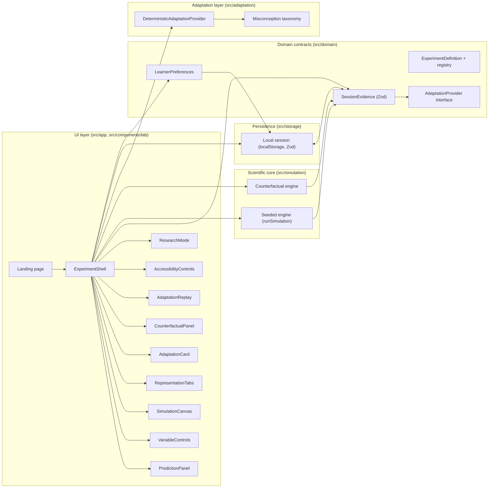

# UnseenLab — Architecture

## High-level diagram

## Components

### Simulation engine (`src/simulation/nuclear-chain-reaction.ts`)

Deterministic, seeded (mulberry32) conceptual model. One step = one generation: each neutron rolls escape (0.12), then absorption (absorptionProbability × absorberPosition), then fission (materialDensity × 0.5), releasing one extra net neutron. Safety caps: population ceiling 500 (stop), step limit (stop), parameter clamping, nonnegativity. Same seed + same parameters ⇒ identical result. Exposes `runSimulation(params): SimulationRunResult`.

### Experiment registry (`src/domain/experiments.ts`)

Typed `ExperimentDefinition` per lab: id, title, pitch, goal, parameter specs (min/max/step/label/plain explanation), defaults, status (`ready` | `planned`). Registry maps lab id → definition. Future labs register here without touching the shell.

### Learner preferences (`src/domain/learner.ts`)

Explicit, learner-controlled settings: animation speed, reduced motion, information density, preferred representations, feedback timing, one-variable mode, high contrast, text scale. Zod-validated; persisted locally.

### Session evidence (`src/domain/evidence.ts`)

Typed, Zod-validated records: predictions (answer, structured key, confidence, timestamps), trials (parameters, snapshots, changed variables), representation events, adaptation proposals (type, reason, evidence IDs, proposed changes, decision), concept evidence. This is the data the adaptation layer reads and the replay renders.

### Adaptation provider (`src/adaptation/`)

`AdaptationProvider.propose(input): Promise<AdaptationProposal[]>` — typed input/output, replaceable. `DeterministicAdaptationProvider` applies bounded rules in a fixed order (ask prediction again, freeze variables, show graph, compare trials, slow animation, causal view, reduce density), capped at 3 proposals, never re-offering rejected types, never increasing motion intensity under reduced motion, and attaching evidence IDs to every proposal. `misconception-taxonomy.ts` classifies evidence into five concepts with conservative structured/keyword matching (documented offline fallback).

### Representation layer (`src/components/lab/representation-tabs.tsx`)

Five learner-switchable views of the same trial: animation (canvas), graph (custom SVG chart — no chart library), equation (abstract balance with the trial's numbers), causal (SVG flow diagram), plain language (generated summary). All reads only.

### Counterfactual engine (`src/simulation/counterfactual.ts`)

Deep-clones the original trial's parameters, changes exactly one of four allowed variables, keeps the same seed and duration, runs the engine, returns `{ original, counterfactual, changedVariable }` with the original untouched (reference identity preserved). Same seed ⇒ identical randomness ⇒ difference is attributable to the single variable.

### Replay timeline (`src/components/lab/adaptation-replay.tsx`)

Renders the recorded journey: initial prediction → variables changed → outcome → interaction pattern → possible conceptual friction → adaptation offer + decision → updated prediction → counterfactual → evidence of changed understanding. Pure rendering of session evidence.

### Persistence (`src/storage/session-storage.ts`)

Anonymous localStorage persistence with Zod validation on read; corrupt data fails safe to defaults; no telemetry. `exportSessionJson` / `clearLocalSession` back the research mode.

## Data flow (one trial)

1. Learner submits prediction → `PredictionRecord` appended to session evidence.
2. Learner changes variables → diff computed vs. previous trial at run time.
3. Run → `runSimulation(clamped parameters)` → `TrialRecord` (id = prediction's trialId) appended.
4. `classifyConceptEvidence(input)` → `ConceptEvidence[]` appended.
5. `DeterministicAdaptationProvider.propose(input)` → pending proposals appended; UI shows adaptation cards.
6. Decision (accept/reject/modify) → proposal updated; accepted changes applied to preferences and persisted.
7. Counterfactual runs append `cf-*` trials; replay reads the full evidence.
8. Research mode exports or clears the session.

## Test boundaries

- `tests/simulation/` — engine invariants, determinism, caps, clamping, monotonicity (expected-value checks), counterfactual one-variable + immutability. No React.
- `tests/adaptation/` — rule selection, evidence IDs, rejection rule, reduced-motion rule, taxonomy classification. No React.
- `tests/components/` — learner flow through the real shell: prediction required, run, adaptation accept/reject, safety ceiling, clear session, canvas reduced motion and stepping, replay rendering. React Testing Library + jsdom, real deterministic engine (no mocks of science).
- `e2e/` — one Playwright smoke covering the demo flow in a real browser against the production build.
